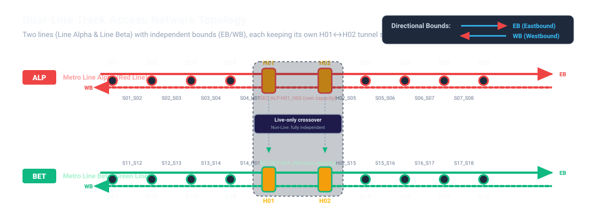

 

# Problem Statement 1 — Railway Track Access Optimisation

<!--
TEMPLATE STRUCTURE (replicable for any PS):
1. Challenge Statement   — the ask, in one line + non-negotiables. Same shape across all PS.
2. Challenge Details      — everything problem-specific: domain model, data, rules, scenarios,
                            output schema, tooling, traps. This section differs per PS.
3. Expectations & Goals   — scope (in/out), phased roadmap, rubric, bonus scope.
4. Deliverables           — what to submit, in what form.
-->

## 1. Challenge Statement

**Build a tool that decides who gets the track, on which nights, for the dual-line rail network (Line Alpha & Line Beta) — and proves its answer.**

Every night, between the last train and the first, a few hours exist in which physical work can happen on the railway: renewals, construction, maintenance. Every one of those nights is contested. The contractors want access to the same tunnel and platform sectors, each bringing its own safety buffers, its own possession type, its own deadlines — and the network has one tunnel section that physically belongs to both lines at once.

The plan you produce is not advisory. It is a possession schedule: concrete activities, concrete weeks, concrete locations of a possession, that a works controller could dispatch against. And it will be checked — mechanically, by the same validator the judges run.

**Non-negotiables:**

- **Complete Workload Baseline** — 100% of activities in `08_ACTIVITY_DETAILS.csv` must be scheduled and their full access workloads accounted for. You cannot drop, omit, or truncate activities to avoid congestion. Full delivery is the mandatory baseline gate before any completion overrun or schedule quality metrics are evaluated.
- **Feasibility First** — Hard physical safety rules (exclusion buffers, 750V live-rail opposite-bound mirroring, the `Live`-only interchange crossover, location capacities, legal mix rules, weekly allocation budgets, and workfront caps) must never be breached.
- **Keep Scheduling Under Congestion** — When demand outstrips supply, the solver must not stop or declare the case impossible. It should keep packing co-sharing locations and compressing timelines to reach the **least planned completion overrun**.
- **Co-Sharing Increases Capacity** — Nightly capacity for track access increases if compatible work is packed into shared sectors (`co_share_group`), increases nightly access throughput. Buffers never overlap: only `Live`/`Non-live(Consist)` possessions carry an exclusion buffer (`Non-live(others)` carries none), and one possession's buffer must clear before the next possession's span or buffer can begin.

---

## 2. Challenge Details

### 2.1 Introduction

Think of track scheduling like managing rolling construction zones along a multi-lane highway:

1. **Tunnel Sectors & Platform Sectors:** Railway split into station **platform sectors** (`PLAT`) and track **tunnel sectors** between stations (`SEC`). Work from station A to B occupies every tunnel sector and platform sector in between.
2. **Maintenance Priority & Remaining Access Pool:** In-house maintenance takes priority first (patrol, grinding, signaling), reserving its nights. **Remaining nights** per segment (e.g. `S01–S02`, 4 nights in Week 4, per `LOCATION_SUPPLY`) pass to the **LTA works scheduler**.
3. **Scheduler's Allocation Power:** LTA scheduler distributes remaining nights across contracted programmes (e.g. `C001`, `C002`) to best meet delivery goals.
4. **Weekly Access Cap:** `PROJECT_DETAILS.number_of_maximum_access_per_week` is the per-contract weekly cap — 2 access-nights per week for `Live` contracts, 3 for all others, the same value every week of the horizon. This flat column is the cap the validator enforces directly (§2.4 rule 7).
5. **Co-Sharing:** A `PC` activity can **co-share** its location slot with a `C` activity. `PC` and `C` are already buffer-free against each other by rule, so co-sharing isn't waiving a buffer that would otherwise apply — it's allowed to pack a `PC` and a `C` into the same slot at the same time. `C`and other `C` can also co-share the same location at the same time.

   *Example:* Tunnel sector `S01–S02` has 1 slot on a given night. Contract `C001` needs `PC` there and Contract `C002` needs `C` there. Both fit in that one slot simultaneously — no buffer between them, so no exclusion zone to negotiate.
6. **Safety Buffers:** Non-co-sharing activities get exclusion zones ahead/behind the worksite to prevent collisions.
7. **Live Rail (750V):** Live-rail work cuts third-rail power; closures **mirror onto the opposite bound** (`EB ↔ WB`).
8. **Interchange stations:** Are stations with the same station name, with two distinct tunnel and platform sectors. They have unique exception rules when live activities are carried out. refer to 2.2 below.
9. **Predecessors:** Some activities can't start until another activity finishes — e.g. track renewal before signaling work on the same section. `predecessor_activity_id` marks this dependency; refer to 2.4 rule 3.
10. **Why Re-Planning Matters:** Master plans are set weeks ahead, but disruptions (urgent maintenance, defects, delays) force hours of manual replanning — buffers, mirroring, co-sharing all re-checked by hand. Tooling must automate impact assessment and re-optimization with minimal churn.

### 2.2 The Network



**Line Alpha (`ALP`)** and **Line Beta (`BET`)** — exactly 10 stations each (8 exclusive stations S01–S08 on Alpha and S11–S18 on Beta, plus 2 interchange hubs H01 and H02), with two interchange hubs (`Hub H01` and `Hub H02`) that exist on both lines. Every station — interchange hubs included — has its own platform per bound per line; a normal station's `EB` and `WB` platforms are already independent locations, so one `PC` on `EB` and one `PC` on `WB` can run concurrently. Three features drive everything:

- **Two independent bounds.** Each line has an eastbound (`EB`) and a westbound (`WB`) track. They schedule separately — except for the couplings below.
- **Two separate things get booked.** Capacity is tracked in two places: the **tunnel sector** (the stretch of track between stations, e.g. `SEC:ALP:S02_S03:EB`) and the **platform sector** (the station itself, e.g. `PLAT:ALP:S03:EB`). A job that runs from one station to another must book every tunnel sector and platform sector it passes through along the way — from where it starts ("book-in") to where it ends ("book-out").

**Interchange stations:** Tunnel `H01 ↔ H02` is physically two adjacent tunnels, not one shared track.

- **Own capacity per line:** Alpha has its own `SEC:ALP:H01_H02` tunnel sector (and own `H01`/`H02` platforms), Beta has its own `SEC:BET:H01_H02` tunnel sector (and own platforms). Booking Alpha's tunnel sector never draws down Beta's.
- **The one exception — `Live`:** cutting traction power at the interchange affects both tunnels, so a `Live` activity's closure also closes the other line's `H01_H02` tunnel sector and `H01`/`H02` platforms. Every other activity type (`PC`/`PM`/`C`) stays confined to its own line.

*Example:* Each line's tunnel sector holds up to 4 activities a night (1 `PC` + 3 `C`, or 4 `C`). Separately, each interchange station has 4 platforms (`EB`/`WB` × Alpha/Beta), and each platform holds up to 4 activities the same way — 16 total across the station's platforms.

### 2.3 The Demand

**Contracts** (programmes of work) carry:

- **Nature of works** (sizes the buffer): `Live` (2 sectors, both sides + mirrors opposite bound), `Non-live (Consist)` (1 sector buffer, both sides), `Non-live (Others)` (no buffer).
- **Access type:** `PM` (sole possession, alone in its location), `PC` (possession master, may host co-workers), `C` (co-worker).
- **Weekly allocation:** Flat per-contract weekly cap (`PROJECT_DETAILS.number_of_maximum_access_per_week` — 2 for `Live` contracts, 3 for all others, same value every week), apportioned by LTA scheduler after maintenance claims its priority nights (e.g. `S01–S02`'s 4 nights split between `C001`/`C002`).
- **Dates & priority:** `contract_completion_date` (contractual deadline) vs `planned_completion_date` (target). All activities must reach 100% completion — none dropped. When demand outstrips capacity, overrun past completion dates is allowed, but goal is **least planned overrun**, prioritizing Priority 1 > 2 > 3, never breaching safety. Overrun weighting is scored at the **contract's** priority tier (`contract_priority`), not the individual activity's `activity_priority` — see §2.7's `priority_overrun`.
- **Workfront**: each contract has a maximum number of concurrent work that can be carried out per night. e.g. if contract C-001 has workfront = 2, it can only work on maximum 2 activities concurrently on the same night.

**Activities** — the jobs within a contract:

- Working section (`start_location_id` → `end_location_id`).
- Workload in access-nights (`total_accesses`).
- `planned_start_date`, `activity_priority` (1 High, 2 Default, 3 Low).
- `predecessor_activity_id` (nullable): some activities depend on another activity finishing first — see §2.4 rule 3.

### 2.4 Operating Rules: Strict Constraints vs Optimization Targets

**Strict (Rigid) Rules — Must Never Be Violated:**

1. **Workload Conservation:** Every activity in `08_ACTIVITY_DETAILS.csv` must be scheduled, nightly yields summing to ≥ `total_accesses` (standard night = 1.0; ECLO = 1.5). None dropped, omitted, or partial — mandatory gate before any quality scoring.
2. **Planned Start Date:** No activity starts before its planned start week.
3. **Predecessor Precedence:** If an activity names another as `predecessor_activity_id`, it must not start until that predecessor has finished — finish-to-start, zero lag (`FS+0`). "Finished" = the week of the predecessor's last scheduled access night; the successor's first scheduled access night must fall in a strictly later week. Cross-contract predecessor links are allowed; predecessor cycles are not.
4. **Closures and Buffers:** Occupied night maintenance work closes a sector; no external activity may enter it that night. Only `Live`/`Non-Live(Consist)` carry a buffer (`Non-Live(Others)` has none); `Live` mirrors closure to opposite bound, and — only for `Live` — also crosses onto the other line's `H01_H02` tunnel sector/platforms at the interchange. Non-Live work never crosses lines there; each line's tunnel and platform sectors are independent capacity. Buffers never overlap — a `Live`/`Non-Live(Consist)` work whose buffer reaches, say, `S02` pushes the next `Live`/`Non-Live(Consist)` work on that bound to start no earlier than `S03`.
5. **Possession Locations & Legal Mixes:** Per location-week, locations pack up to capacity: one `PM` alone, or one `PC` + ≤3 `C`, or ≤4 `C`.
6. **Co-Sharing Exemption:** Same `(location_id, week, co_share_group)` = one possession (one access-night slot) — no buffers between them, exempt from each other's closures. Different `co_share_group` values at the same location/week are separate possessions on separate nights within that week's allocation, and buffers apply normally between them.
7. **Weekly Allocation:** Contract type cannot use more distinct `access_night` values in a week than its granted access-nights (`number_of_maximum_access_per_week`).
8. **Workfronts:** At most `number_of_workfronts` distinct activities of that type may share the same `access_night` — concurrent teams. Combined with rule 7, a contract+type's max distinct activities in a week is `number_of_maximum_access_per_week × number_of_workfronts` (nights available × teams per night).
9. **Early Closure Late Opening**: Scheduler may request for additional time per night by having early closure/late opening(ECLO). This increases the work duration per night, however, will impact the public commuters travelling hours.
10. **ECLO Continuity Window (Scenario C only):** Sporadic ECLO nights confuse commuters, so under Scenario C (refer to 2.5) every `eclo=1` access affecting a given line must fall within one continuous span of at most 2 calendar weeks — chosen independently per line (Alpha and Beta each get their own window). A cross-line `Live` activity's ECLO nights must fit both lines' windows at once. Since an activity gets at most one access-night per week, this caps any single activity at 2 ECLO nights within C. **Scenario B is exempt** — it's already the "pay whatever it takes to hit the schedule" scenario, so its ECLO nights may land anywhere. Vacuous in Scenario A, where ECLO is already forbidden outright.

### 2.5 Objectives & Simulation Scenarios

Possible scenarios for scheduler output,

- **Scenario A (Strict Supply, Flexible Schedule):** Track capacity limits are rigid and fixed (zero excess capacity permitted — the validator hard-fails any submission that exceeds `LOCATION_SUPPLY` capacity, tag `capacity`). **ECLO is also hard-forbidden in this scenario** (any `eclo=1` access is a hard violation, tag `eclo`) — strict supply means no negotiable levers at all besides schedule slip. Output should minimize project delays vs `planned_completion_date`, heavily penalizing delays on Priority 1 contracts.
- **Scenario B (Strict Schedule, Flexible Supply):** Planned completion dates are rigid and fixed (the validator hard-fails any overrun past `planned_completion_date`, tag `planned_date`) — a feasible Scenario B submission therefore has **zero overrun** by construction, so `overrun_days`/priority-weighted overrun play no part in its soft score. Instead, score Scenario B by how much extra it cost to hit those fixed dates: the count of **additional access-nights** used above nominal weekly supply (weighted heavily — extra access-nights are hard to secure operationally), plus the usual ECLO penalty — capacity excess is scored, not hard-failed, in this scenario.
- **Scenario C (Balanced / Elastic Trade-off):** A realistic compromise where neither supply nor schedule is absolute. Its score combines both A's and B's terms — priority-weighted overrun *and* excess access-nights above nominal supply — so the output seeks the Pareto frontier, balancing minor localized capacity strain against project delay minimization, weighted by contract priority tiers. Unlike A, the validator gives C a narrow, deliberate allowance: **up to 1 excess access-night per location-week** is soft-scored rather than hard-failed (tag `capacity` still fires beyond that 1) — a slight elasticity, not B's unlimited "pay whatever it takes." The instance's own `LOCATION_SUPPLY` data (a Scenario C instance generated with amended, higher local supply in specific spots) is a separate, additional source of elasticity on top of this per-week allowance.

**All scores below are penalties — lower is better, zero is perfect.** Every term is a cost added onto the total.

**Additional considerations your output can weigh (all scenarios, except where noted):**

1. **ECLO Minimisation (Scenarios B/C only — hard-forbidden in A, see §2.5):** ECLO buys +1.5 working hours on a night, yielding **1.5× work units** toward `total_accesses` (e.g. a 3-night activity finishes in 2 ECLO nights). Because early closure curtails passenger service, favour it only when it's the schedule's only way to avoid a worse outcome — the objective function penalises unnecessary use at **$5\times$ per ECLO-night used**, flat regardless of which contract's activity it serves.
2. **Priority Weighting :** Delay cost is set by **two independent, stacked** signals:
   - **Contract tier** (`contract_priority`) sets the *band*, and is the dominant lever: $100\times$ per overrun-day for Priority 1, $10\times$ for Priority 2, $1\times$ for Priority 3.
   - **Activity `activity_priority`** only *nudges the multiplier within its own contract's band*: $+0.3$ / $+0.2$ / $+0.0$ added on top of the contract's tier weight. A Priority-1 contract therefore costs $100$–$130\times$ per overrun-day depending on which activity is late inside it — but the nudge never lets it drop below $100\times$ or lets a lower-tier contract's activity cross into a higher tier's band (a Priority-2 contract's ceiling is $13\times$, still nowhere near Priority-1's floor of $100\times$). **Contract tier decides which band you're in; `activity_priority` only moves you around inside it.**

**Combined objective (penalty score, lower is better):**

$$
\text{Score}_{A} = \sum_{\text{tier}} \left(\text{priority\_weight}_{\text{tier}} \times \text{overrun\_days}_{\text{tier}}\right)
$$

(No ECLO term — ECLO is hard-forbidden in Scenario A, not merely penalised, so `eclo_nights_total` is always 0 for any feasible A submission.)

$$
\text{Score}_{B} = 7 \times \text{excess\_access\_nights\_total} \;+\; 5 \times \text{eclo\_nights\_total}
$$

$$
\text{Score}_{C} = \sum_{\text{tier}} \left(\text{priority\_weight}_{\text{tier}} \times \text{overrun\_days}_{\text{tier}}\right) \;+\; 7 \times \text{excess\_access\_nights\_total} \;+\; 5 \times \text{eclo\_nights\_total}
$$

Scenario A scores on priority-weighted overrun only (dates are the flexible side, supply is rigid, and ECLO/additional night access is hard-forbidden). Scenario B has no overrun term — dates are rigid, so a feasible submission scores instead on the number of additional access-nights spent above nominal supply, plus the ECLO penalty. Scenario C, being neither rigid, carries **both** terms — A's overrun component and B's excess-access-nights component — since the instance's amended `LOCATION_SUPPLY` gives it room to flex on both sides at once — and, like B, still permits ECLO as a genuine trade-off lever.

**Worked example — 1-calendar-week overrun, priced differently depending on where it sits** (the overrun-day rows apply to A/C; the excess-access-night and ECLO rows apply to **B/C only** — Scenario A forbids both, so it has no lever besides accepting the overrun itself; cost = tier-weight × (1 + activity_priority nudge) × days, or the flat ECLO/excess-night rate):

| Penalty source                                                                        | Calculation                           | Cost | Relative to a P3 overrun-day |
| ------------------------------------------------------------------------------------- | ------------------------------------- | ---- | ---------------------------- |
| P3 contract,`activity_priority = 3` Activity 3, 7 days, change to activity priority | $1 \times (1+0.0) \times 7(days)$   | 7    | 1×                          |
| P3 contract,`activity_priority = 1`  activity, 7 days                              | $1 \times (1+0.3) \times 7(days)$   | 9.1  | 1.3×                        |
| P2 contract,`activity_priority = 3`  activity, 7 days                              | $10 \times (1+0.0) \times 7(days)$  | 70   | 10×                         |
| P1 contract,`activity_priority = 3`  activity, 7 days                              | $100 \times (1+0.0) \times 7(days)$ | 700  | 100×                        |
| Excess access-nights (Scenario B/C), 3 nights                                         | $7 \times 3(nights)$                | 21   | 3×                          |
| 6 ECLO nights used instead of overrunning                                             | $5 \times 6 (nights)$               | 30   | 4.3×                        |

Reading it as an ordering, cheapest to costliest per unit: **P3 overrun-day (1×~1.3x)  < excess access-night (3x) < ECLO night (4.3x)< P2 overrun-day (10×) < P1 overrun-day (100×)**. Practically, **in Scenarios B/C**: a solver should absorb schedule pressure with Priority-3 slip first, reach for ECLO next, and only spend extra access-nights when ECLO headroom is exhausted — extra nights are operationally scarce to secure and now cost more per unit than an ECLO-night — before ever delaying Priority-2/Priority-1 contracts as a last resort. The `activity_priority` nudge is a tie-breaker *within* a contract, never a reason to prefer delaying a higher-tier contract over a lower-tier one.

**In Scenario A, only the first four options are legit**— ECLO and excess-access-nights aren't legal moves at all (both hard-forbidden), so the only lever is which contract's overrun to absorb: Priority-3 slip first, Priority-2 next, Priority-1 only as an absolute last resort. There is no early-closure or extra-night option to reach for instead.

### 2.6 Output Schema (What Your Tool Produces)

Each of the three scenarios (A, B, C) is a distinct answer key: its own policy trade-off, so its own submission. For **each scenario**, your tool must produce strictly three CSV files:

1. **`SCHEDULE_ACCESS.csv`** — Activity access placement per week:
   `activity_id,access_seq,week,eclo,access_night`
   *(eclo is 0 for standard night, 1 for ECLO night. `access_night` is which
   of that (contract_number, activity_type)'s granted weekly nights (1..
   `number_of_maximum_access_per_week`) this access falls on — a local
   accounting index per contract+type+week, independent of location/sector. It's what rule 8 (workfronts) and rule 7 (weekly allocation)
   below are checked against.)*
2. **`SCHEDULE_OCCUPANCY.csv`** — Location and slot assignment per week:
   `activity_id,week,location_id,co_share_group`
   *(`co_share_group` is an arbitrary label like `b1`, `b2` identifying which possession location the activity occupies. Use `python3 -m trackaccess expand` to auto-generate this.)*
3. **`RESULTS.csv`** — Contract completion summary:
   `scenario,contract_number,simulated_completion_date,overrun_days`
   *(one scenario per `RESULTS.csv` — the validator rejects a file mixing more than one)*

That is **three scenario answer keys**, each its own set of `SCHEDULE_ACCESS.csv` / `SCHEDULE_OCCUPANCY.csv` / `RESULTS.csv`, validated independently.

### 2.7 Output

#### The output report

```json
{
  "scenario": "A",
  "feasible": false,
  "hard_violations": [
    {"rule": "closure", "severity": "hard", "detail": "wk4: A012 inside closure of ['A010'] at ['SEC:ALP:S02_S03:EB']"}
  ],
  "soft_scores": {
    "scenario": "A",
    "overrun_days_total": 126,
    "contracts_overrunning": 7,
    "earliness_days_total": 0,
    "excess_access_nights_total": 0,
    "eclo_nights_total": 0,
    "priority_overrun": {"1": 147, "2": 98, "3": 133},
    "priority_weighted_score": 18470.6
  },
  "detail": {"capacity_hotspots": [], "nights_scheduled": 59, "eclo_nights": 0}
}
```

- **`scenario`** — which of A/B/C this submission was validated against (read from `RESULTS.csv`).
- **`feasible`** — `true` only if `hard_violations` is empty.
- **`hard_violations`** — one entry per breach, each `{rule, severity, detail}` — `rule` matches the check tags above, `detail` is a human-readable pinpoint (activity, week, location). Empty when feasible.
- **`soft_scores`** — populated on every run (empty only if the instance/submission files fail to parse), the quality metrics behind §2.5's objectives; `objective_score`/`formula_version` (§2.5's combined score) are added on top only when `feasible`:
  - `overrun_days_total` / `contracts_overrunning` / `earliness_days_total` — completion-date performance.
  - `excess_access_nights_total` — additional access-nights used above nominal `LOCATION_SUPPLY`, summed across location-weeks: how far Scenario B/C's flexible supply had to stretch. Hard-checked as `capacity` in A (zero tolerance) and in C beyond 1 excess access-night per location-week; unlimited (soft-scored only) in B. This feeds Scenario B's score directly, and Scenario C's alongside its overrun term (§2.5).
  - `eclo_nights_total` — ECLO usage (§2.5 soft objective 1). Always 0 for Scenario A — any nonzero value there is a hard `eclo` violation, not a soft cost.
  - `priority_overrun` — raw overrun-days summed by **contract priority** (`contract_priority`, §2.3): tier "1" gets every overrun-day belonging to a Priority-1 contract, regardless of which activity inside it was late. Does not use `activity_priority` at all — a Priority-1 activity overrunning inside a Priority-3 contract counts the same as a Priority-3 activity in that same contract.
  - `priority_weighted_score` — the banded score (§2.5 soft objective 2): `contract_weight × (1 + activity_priority) × overrun_days`, summed per overrunning activity. `contract_weight` is $100/10/1$ for contract tier 1/2/3. `activity_priority` is $+0.3/+0.2/+0.0$ for the activity's own `activity_priority` 1/2/3, added on top of `contract_weight`. Contract tier sets the main score band; `activity_priority` adjusts the score within that band.
- **`detail`** — supplementary diagnostics: `capacity_hotspots` (locations/weeks running at or near capacity), `nights_scheduled` (total access-nights across all activities), `eclo_nights` (of those, how many were ECLO). Empty only when the instance/submission files themselves fail to parse.

A worked example of the validator's own output (not runnable here — see the note above): the `03_submission_sample/` folder in this info pack is a feasible, 0-hard-violation submission against `01_data/` — showing the expected file structure and format, not a tool you invoke.

---

## 3. Expectations & Goals

### 3.1 Scope

Build a **decision-support tool for access planners and works controllers**. Form factor is your choice — web app, desktop tool, CLI, or a service behind a thin UI.

You receive **instance files** (the demand book for a planning horizon) and return **submission files** (the schedule) in the published format. A reference validator — the exact program used for scoring — reports feasibility and score.

### 3.2 Required Capabilities & Judging Rubric

| Dimension                        | What Judges Look For                                                                                                                                                                                                                             |
| -------------------------------- | ------------------------------------------------------------------------------------------------------------------------------------------------------------------------------------------------------------------------------------------------ |
| **1. Problem Fit**         | Handles Scenarios A, B & C sensibly; output is feasible and well-formed; trade-offs and displaced work are explained, not just produced. How you get there is open — any reasonable approach that addresses the real scheduling problem counts. |
| **2. Technical Execution** | Scored directly from the reference **validator's** output run against hidden instances — feasibility, violation count, and score relative to the reference solver's benchmark.                                                             |
| **3. Ease of Use**         | A works controller could actually pick it up and use it. Interface form is your choice — judges are looking for genuine usability, not a specific set of features.                                                                              |

### 3.3 Bonus Scope & Beyond-the-Schedule Innovation

Optional directions worth pursuing:

- **Dynamic Update & Urgent Maintenance Re-Optimization** — impact-assess and auto-replan when a disruption cuts access mid-horizon (e.g. a location's nightly quota drops from 4 to 1–2), with minimal churn on unaffected work.
- **Natural Language Querying** — plain-English Q&A over the schedule (root-cause of a move, downstream delay risk, capacity/co-sharing checks, milestone risk, handover briefs).
- **Open Innovation** — any other high-value feature beyond the core formulation, e.g. predictive bundling, contractor negotiation support, depot/engineering-train logistics, fragility scoring, what-if/digital-twin sandboxing.

---

## 4. Deliverables

Participants must submit the following four deliverables:

1. **Public Test Results:** Pre-computed schedule output files (`SCHEDULE_ACCESS.csv`, `SCHEDULE_OCCUPANCY.csv`, `RESULTS.csv`) for the provided dataset, proving your solver works on known data.
2. **Hosted Live Web App URL:** A running, accessible web application where the judging panel can upload an undisclosed / hidden test instance (the 8 CSV instance files) into the UI to run your scheduler live, visualize the result, and validate the logic.
3. **3-Minute YouTube Video:** A concise video walkthrough demonstrating your application, user experience for a 2AM works controller, scheduling timeline, and explainability features.
4. **GitLab Repository URL:** Complete source code, solver implementation, setup instructions, and documentation.
